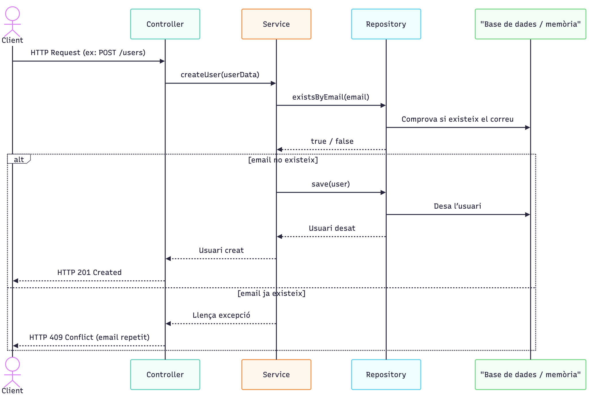

# Tasca S4.01 Introducció a Spring Boot

## 🎯 Objectius

Aquest exercici és la teva primera presa de contacte amb **Spring Boot** i el desenvolupament d’una **API REST**.
L’objectiu és construir una API mínima però funcional, que permeti rebre i retornar dades en format **JSON**, utilitzant mètodes HTTP i aplicant bones pràctiques des del primer moment.

Treballaràs amb els següents conceptes clau, que **hauràs d’entendre i investigar:**

- Què és una **API REST** i com funciona.
- Com definir **endpoints** a través de controladors amb `@RestController`.
- Ús dels mètodes HTTP **GET** i **POST** per recuperar i enviar informació.
- Com rebre dades a través de la URL amb `@PathVariable` i `@RequestParam`.
- Com **rebre dades JSON** a través del cos de la petició amb `@RequestBody`.
- Com **retornar respostes** en format JSON.
- Com **provar manualment** la teva API amb [Postman](https://www.postman.com/) (eina per enviar peticions HTTP).
- Com **provar automàticament** la aplicació amb **MockMvc**,  `@SpringBootTest` i usant **Mockito**
- Com compilar i executar el `.jar` generat amb Maven (Spring Boot inclou el servidor integrat Apache Tomcat).
- Què és el concepte d’**Inversió de Control (IoC)** i com es creen i injecten **Beans**.
- Introducció a l’**arquitectura per capes**, i als patrons **Service Layer** i **Repository**.

Com que aquests són conceptes fonamentals en l’ús de Spring Boot, et recomanem que, en aquesta tasca, desenvolupis els tres nivells.

### 🧱 Configuració del projecte

Crea el projecte a 👉 [https://start.spring.io/](https://start.spring.io/) amb els següents valors:

| Configuració     | Valor                                              |
| ---------------- | -------------------------------------------------- |
| **PROJECT**      | Maven                                              |
| **LANGUAGE**     | Java                                               |
| **SPRING BOOT**  | La darrera versió estable                          |
| **Group**        | `cat.itacademy.s04.t01`                        |
| **Artifact**     | `userapi`                                          |
| **Name**         | `UserApi`                                          |
| **Description**  | `My first user manager REST API`                            |
| **Package name** | `cat.itacademy.s04.t01.userapi`                |
| **PACKAGING**    | Jar                                                |
| **JAVA**         | Versió 21                                          |
| **Dependències** | Spring Web, Spring Boot DevTools |

---

Configura el port en `src/main/resources/application.properties`:

```
server.port=9000
```

---
## ⭐ Nivell 1 — Primera API Rest

Abans de començar a desenvolupar funcionalitats més avançades, ens assegurarem que l’aplicació arrenca correctament i que respon com esperem.

Ho comprovarem de tres maneres:
- Des del navegador
- Amb un client REST com **Postman**
- Mitjançant un **test automatitzat**

Per fer-ho, crearem un **endpoint de health check**: un punt d’entrada molt senzill que retorna una resposta bàsica com ara `"OK"`. Aquest patró és habitual en sistemes reals per verificar que l’aplicació és viva i funcional.

### 👥 Endpoint GET – health

#### 🛠️ Passos a seguir

1. **Crea un package nou anomenat** `controllers` dins el teu `src/main/java/...`
2. Dins aquest package, **crea una classe** `HealthController` i anota-la amb `@RestController`
3. Afegeix un mètode públic, anotal amb `@GetMapping("/health")` i fes que retorni el text `"OK"`

---

### 🧪 Prova des del navegador

1. Executa l’aplicació (`mvn spring-boot:run` o des de l’IDE)
2. Obre el teu navegador preferit i ves a:

```
<http://localhost:9000/health>
```

Si veus el missatge `OK`, tot està funcionant correctament

---

### 🧪 Prova amb Postman

Ara farem la mateixa prova usant **Postman**, un client REST per fer peticions HTTP.

1. Descarrega i instal·la [Postman](https://www.postman.com/downloads/)
2. Crea una nova petició `GET` al mateix endpoint
3. Prem **Send** i comprova que reps el text `OK` com a resposta.

> ✅ Quan hagis confirmat que tot funciona correctament, fes un commit per no perdre els canvis. Recorda utilitzar el format de [**conventional commits**](https://www.conventionalcommits.org) i escriure un missatge clar i en anglès.

📦 Exemple de commit:

```
feat: add basic health check endpoint
```

---

### 🔄 Millora: retornar JSON en comptes de text pla

Fins ara retornaves simplement un `String` amb el text `"OK"`. Tot i que és funcional, en el món real és molt més habitual que les APIs **retornin objectes JSON estructurats**.

L’objectiu és que la teva resposta tingui aquest format:

```json
{
  "status": "OK"
}
```

Això facilita la integració amb altres serveis, la monitorització, i manté una estructura coherent en tota l’API.

### 🛠️ Què has de fer?

1. Crea una nova **classe o `record`** amb una propietat anomenada `status`. Jackson automàticament la convertirà a JSON.
2. Modifica el teu `controller` perquè retorni una instància d’aquest objecte en lloc d’un `String`.

> Un cop ho tinguis, torna a provar el teu endpoint i comprova que reps una resposta JSON amb status a "OK" i fes un altre commit que expliqui el que s’ha fet.

--- 

### 🧪 Primer test bàsic del controlador

Ara que ja tens un endpoint que retorna JSON, és un bon moment per afegir el primer test automàtic.

Farem un test molt bàsic per comprovar que l’endpoint `/health` retorna una resposta que conté un `status`: `OK`.

Aquest tipus de test serveix per **comprovar que el controlador respon correctament a una petició HTTP**, sense necessitat d’aixecar tota l’aplicació. És un test molt comú en Spring Boot, conegut com a **test de la web layer.**

A continuació tens un exemple complet del test **amb comentaris** perquè entenguis cada pas.

```java
// Indiquem que aquest test només carrega la capa web (controladors)
@WebMvcTest
class HealthControllerTest {

    // Injectem MockMvc, que ens permet simular peticions HTTP
    @Autowired
    private MockMvc mockMvc;

    @Test
    void shouldReturnOkStatus() throws Exception {
        // Simulem una petició GET a /health
        mockMvc.perform(get("/health"))
            // Verifiquem que el codi de resposta és 200 OK
            .andExpect(status().isOk())
            // Comprovem que la resposta JSON conté "status": "OK"
            .andExpect(jsonPath("$.status").value("OK"));
    }
}
```

> **Executa el test** des d’IntelliJ o amb Maven: `mvn test` Si el test passa, vol dir que la teva API ja pot ser comprovada automàticament. 👉🏽 Fes un commit amb un missatge clar com: `test: verify /health returns status OK`

---
### 🚀 Executar la teva API com a `.jar`

Spring Boot genera un arxiu `.jar` executable amb tot el necessari (incloent el servidor Tomcat) perquè puguis **executar la teva aplicació com si fos un programa independent**.

#### 🛠️ Passos per empaquetar i executar

1. Obre un terminal i col·loca’t a l’arrel del projecte.
2. Executa la comanda següent per generar el `.jar`:

   ```bash
   mvn clean package
   ```

3. Si tot ha anat bé, trobaràs un arxiu `.jar` dins la carpeta `target/`. L’arxiu es dirà:

   ```
   userapi-0.0.1-SNAPSHOT.jar
   ```

4. Ara pots executar la teva aplicació amb:

   ```bash
   java -jar target/userapi-0.0.1-SNAPSHOT.jar
   ```

5. Un cop arrencada, torna al navegador o Postman i comprova que el teu endpoint `/health` segueix funcionant a:

   ```
   http://localhost:9000/health
   ```

> ✅ Fes una captura de pantalla de la terminal amb l'execució del `.jar` i guarda-la al teu repositori com a evidència del funcionament.


---

## ⭐⭐ Nivell 2 — Gestionar una llista d’usuaris en memòria

Ara que ja tens l’aplicació en marxa i respon correctament, és moment de començar a gestionar dades. En aquest nivell, crearàs una funcionalitat bàsica per **gestionar usuaris en memòria**, **sense base de dades**, mitjançant una **llista interna dins del controlador `UserController`**, que posteriorment refactoritzarem.

Aquest exercici et permet practicar com enviar i rebre dades en format **JSON**, així com explorar diferents formes de passar informació a través d’un endpoint.

---

### 📋 Objectius

- Retornar una **llista d’objectes** en format JSON.
- Rebre dades des del **cos de la petició** mitjançant `@RequestBody`.
- Generar **identificadors únics** amb `UUID`.
- Accedir a valors dins la **ruta de l’URL** mitjançant `@PathVariable`.
- Realitzar **filtres amb paràmetres de consulta** mitjançant `@RequestParam`.

---

## 👣 Passos a seguir

> 📌 Fes un **commit per cada funcionalitat nova**, utilitzant el format de [Conventional Commits](https://www.conventionalcommits.org/) i assegurant-te que la descripció sigui clara i significativa.

---

### 1. Crear el model `User`

Crea una classe `User` dins d’un paquet `models` o `entities` amb les següents propietats:

- `id` (tipus `UUID`)
- `name` (tipus `String`)
- `email` (tipus `String`)

---

### 2. Simular una base de dades

Crea un controlador anomenat `UserController`. Dins la classe, defineix com atribut una **llista estàtica** d’usuaris que actuarà com a memòria temporal. Aquesta llista representarà la nostra “base de dades” per aquest exercici. Inicialment, ha d’estar buida.

---

### 3. Endpoint `GET /users` — Llistar tots els usuaris

Crea un endpoint que retorni la llista actual d’usuaris. Inicialment, aquest endpoint ha de respondre amb un array buit (`[]`).

> 🧪 Prova-ho amb Postman: fes una petició GET a `http://localhost:9000/users` i comprova la resposta.

---

### 4. Endpoint `POST /users` — Crear un nou usuari

Crea un endpoint que permeti afegir un usuari a la llista. Aquest endpoint ha de:

- Rebre un JSON amb els camps `name` i `email` (usant `@RequestBody`).
- Generar un `UUID` aleatori per al nou usuari.
- Crear l’objecte `User` complet amb l’`id`, `name` i `email`.
- Afegir-lo a la llista.
- Retornar com a resposta l’usuari afegit.

> 💡 **Per què fem servir `UUID`?**
> 
> Com que no tenim una base de dades que generi identificadors automàticament, utilitzem `UUID` com a forma senzilla i segura de generar **identificadors únics** des del codi.


> 🧪 Prova-ho amb Postman: envia una petició POST amb un JSON com el seguent i comprova que reps una resposta amb un `id` generat:

```json
{ 
	"name": "Ada Lovelace",
	"email": "ada@example.com"
}
```


> 🧪  Després, torna a fer una petició a `GET /users` i verifica que el nou usuari ja forma part de la llista.

---
### 5. Endpoint `GET /users/{id}` — Consultar un usuari per ID

Afegirem un nou endpoint que permeti **recuperar un usuari concret** a partir del seu identificador únic.

- Aquest endpoint utilitza `@PathVariable` per llegir l’`id` des de la ruta.
- Buscarà a la llista l’usuari amb aquell `id`.
- Si el troba, retornarà l’usuari com a JSON.
- Si no el troba, pots retornar un codi de resposta `NotFound`(404). Això es pot fer de varies maneres ara et proposem usar una excepció en runtime personalitzada que pots anotar com `@ResponseStatus(HttpStatus.NOT_FOUND)`

> 🧪 Prova-ho amb Postman usant un `GET /users/{id}` amb un ID que s’hagi creat prèviament.

---

### 6. Endpoint `GET /users?name=...` — Filtrar usuaris per nom

Millorarem l’endpoint existent de `GET /users` per permetre **cercar usuaris pel nom** mitjançant un **paràmetre de consulta opcional** a la URL, utilitzant `@RequestParam`.

- Si no especifiques cap nom, es retornaran **tots els usuaris**.
- Si afegeixes el paràmetre `?name=`, es filtraran els usuaris que **incloguin el text indicat** dins del camp `name` (la cerca no ha de distingir entre majúscules i minúscules).


> 🧪 Prova-ho amb Postman usant una URL com: `GET http://localhost:9000/users?name=ada` 

---

### 🧪 7. Escriure tests per als endpoints

Ara que hem implementat diversos endpoints en el nostre controlador, és el moment d’escriure **tests automàtics** per verificar que funcionen com esperem.

Els tests que farem són de tipus **test de controladors** (o tests de capa web). No necessitem una base de dades ni serveis externs: només provarem que les rutes (`endpoints`) responen correctament davant diferents peticions.

#### 🎯 Objectius del test

- Assegurar que `GET /users` retorna una llista correcta.
- Verificar que `POST /users` afegeix un usuari i retorna el resultat amb el seu `UUID`.
- Comprovar que `GET /users/{id}` retorna l’usuari correcte si existeix.
- Retornar error 404 si es demana un `id` que no existeix.
- Validar que el filtre per nom `GET /users?name=` funciona com cal.

---

### 👨‍🔬 Què necessitaràs

- Utilitzar `JUnit 5` per definir els tests. (Ja inclos a Spring boot test)
- Utilitzar `MockMvc`, una eina que ens permet simular peticions HTTP dins dels tests.
- Pots usar `ObjectMapper` per convertir objectes Java a JSON i viceversa.

---

### 👣 Passos per fer els tests

1. **Crea una classe de test per `UserController`**
2. **Anota la classe amb `@WebMvcTest(UserController.class)`**
   Aquesta anotació carrega només la part web de Spring (no serveis ni base de dades), ideal per tests d’endpoints.
3. **Crea un test per a cada funcionalitat clau** (Pots seguir la seguent guía per ferho)

```java
@WebMvcTest(UserController.class)
class UserControllerTest {

    @Autowired
    private MockMvc mockMvc;

    @Autowired
    private ObjectMapper objectMapper;

    @Test
    void getUsers_returnsEmptyListInitially() {
        // Simula GET /users
        // Espera un array buit
    }

    @Test
    void createUser_returnsUserWithId() {
        // Simula POST /users amb JSON
        // Espera que torni el mateix usuari amb UUID no nul
    }

    @Test
    void getUserById_returnsCorrectUser() {
        // Primer afegeix un usuari amb POST
        // Després GET /users/{id} i comprova que torni aquest usuari
    }

    @Test
    void getUserById_returnsNotFoundIfMissing() {
        // Simula GET /users/{id} amb un id aleatori
        // Espera 404
    }

    @Test
    void getUsers_withNameParam_returnsFilteredUsers() {
        // Afegeix dos usuaris amb POST
        // Fa GET /users?name=jo i comprova que només torni els que contenen "jo"
    }
}

```

### ✅ Bones pràctiques

- Utilitza noms de test descriptius.
- Fes servir `@BeforeEach` si vols netejar l'estat entre tests.
- Comprova no només el codi de resposta (status code), sinó també el contingut del cos (`body`) de la resposta.

---

## ⭐⭐⭐ Nivell 3 — Refactoritzar a una arquitectura per capes

Ara que ja tens una API bàsica i funcional, és el moment de fer un pas endavant cap a un **disseny més net, professional i fàcil de mantenir**.

Tot i que el nostre `UserController` funciona correctament, està assumint **massa responsabilitats**: controla les peticions HTTP, conté la lògica de negoci i accedeix directament a les dades. Això **viola diversos principis SOLID**, especialment:

- **S** — _Single Responsibility Principle_: hauria de tenir una única responsabilitat (traduir peticions HTTP).
- **D** — _Dependency Inversion Principle_: depèn directament de la implementació concreta de dades (una llista).

Aquest enfocament **no és escalable**, complica el manteniment i fa més difícil afegir noves funcionalitats. Per això, reorganitzarem l’aplicació en una **arquitectura per capes**, separant clarament les responsabilitats:

1. **Controlador (`UserController`)** → s'encarrega de rebre peticions HTTP i delegar al servei.
2. **Servei (`UserService`)** → conté la lògica de negoci: les regles, validacions i processos de l'aplicació.
3. **Repositori (`UserRepository`)** → és l'encarregat d'accedir a les dades (sigui a memòria, base de dades, etc.).

---
### 1. Convertim el test actual en un test d’integració (end-to-end)

Abans de fer la refactorització, adaptarem el test que ja teníem per convertir-lo en un **test d’integració complet**, que provi totes les parts del sistema en conjunt: controlador, servei i repositori.

#### 💡 Per què?

Perquè volem assegurar-nos que, un cop comencem a moure i separar el codi, **tot segueix funcionant com abans**. Si trenquem alguna cosa durant el procés, el test ens avisarà. Això ens dona confiança per refactoritzar.

#### 🛠️ Què cal fer?

- Elimina l’anotació `@WebMvcTest`, que només carregava la capa web.
- Afegeix `@SpringBootTest`, que carrega tota l’aplicació.
- Afegeix `@AutoConfigureMockMvc`, per continuar fent peticions HTTP simulades amb `MockMvc`.

> 🎯 L’objectiu d’aquest test és assegurar-nos que la integració entre capes funciona correctament, no pas cobrir tots els detalls.

---
### 2. El patró repositori

Quan fem aplicacions amb dades (com usuaris), necessitem una manera d’accedir-hi i gestionar-les. Però **no volem que la resta del sistema sàpiga com ho fem exactament**. Podem estar treballant amb una llista en memòria, una base de dades, o llegint d’un arxiu. Això **no hauria de canviar la lògica de l’aplicació**.

#### 🎯 Per això fem servir el **patró repositori**.

Un **repositori** és una interfície (com un contracte) que defineix com accedim a les dades. La idea és separar completament la lògica de negoci (el servei) de la manera com guardem o llegim aquestes dades.

Així, qualsevol capa que necessiti accedir a usuaris (per exemple, el `UserService`) **no sabrà ni li importa** si les dades venen d’una llista, d’una base de dades, o d’una API externa. Només cridarà els mètodes del repositori.

#### ✍️ Com ho implementem

**Primer crea la interfície `UserRepository`**, que defineix els mètodes bàsics que qualsevol repositori d’usuaris ha de tenir, per posar un exemple:

```java
public interface UserRepository {  
    User save(User user);  
    List<User> findAll();  
    Optional<User> findById(UUID id);  
    List<User> searchByName(String name);  
    boolean existsByEmail(String email);  
}
```


**Després fes una implementació concreta** d’aquesta interfície. Com que de moment no tenim base de dades, farem servir una llista en memòria. Aquesta implementació es dirà `InMemoryUserRepository` i contindrà realment el codi que manipula la llista d’usuaris.

**Finalment, afageix l’anotació `@Repository` a la classe**. Això indica a Spring que aquesta classe s’ha d’incloure dins del seu contenidor de _beans_ 

```
🧠 Investiga què són els beans en Spring i com funciona la injecció de dependències.

```

---
### 3. La capa de servei (Service Layer)

Ara que ja tens el repositori separat, toca fer un pas molt important: **crear la capa de servei**, que serà el lloc on viurà la **lògica de negoci** de l’aplicació.

#### 🧠 Per què cal una capa de servei?

Encara que el controlador pot fer crides directament al repositori, no és bona pràctica. El controlador s’hauria d'encarregar només de rebre peticions i retornar respostes. La **lògica de l’aplicació**, les regles i els casos d’ús han de viure en un lloc central: el **servei**.

Això et permetrà:

- Reutilitzar la lògica des d’altres canals (web, REST, CLI…).
- Tenir **tests unitaris més fàcils**, perquè pots provar el servei sense saber res de la web ni de les dades.
- Aplicar regles de negoci de forma clara i centralitzada.

#### 🛠️ Què has de fer?

**Crea una interfície `UserService`**  i defineix-hi els casos d’ús que vols que el sistema ofereixi: crear un usuari, cercar per nom, obtenir per id, etc.

**Crea una classe `UserServiceImpl`** que implementi aquesta interfície. Injecta per constructor la interface del repositori que ja tens creat, pasa la lògica que no sigui de dades ni web (http) a cada un dels mètodes del servei. **Sence fer cap accés directe a llistes dins el servei**   sino que sha de delegar ha a través del repositori: el servei no ha de saber com es guarden les dades, només que pot fer certes operacions.

**Marca la classe amb `@Service`** per tal de que Spring la detecti i podrà injectar com a _bean_ a altres parts de l’aplicació com el controller.

Un cop fet això, podràs modificar el controlador perquè **deixi de fer servir directament el repositori o la llista**, i en comptes d’això, **faci crides al servei**. d'igual manera injecta la interface el servei al controlador.

**Exemple: Diagrama de secuencia de crear un usuari**



### 4. Test unitari del servei — Amb Mockito

Un cop tenim la lògica de negoci separada a la capa de servei, podem començar a provar-la **de manera aïllada**, sense dependre de la implementació real del repositori (ni de llista en memòria, ni de base de dades). Per aconseguir-ho, farem servir **Mockito**, una llibreria que ens permet simular el comportament de les dependències.

Això ens permetrà:

- Simular què retorna el repositori (`when(...).thenReturn(...)`).
- Comprovar que el servei fa el que toca davant diferents situacions.
- Verificar que s’han cridat els mètodes esperats al repositori.

L’objectiu és fer **tests unitaris reals**, centrats només en la lògica del servei.

#### 👤 Cas d’ús: crear un usuari amb validació de correu únic

Ara que la lògica de negoci està ben separada, és el moment ideal per afegir una **regla de negoci fonamental**: evitar duplicats de correu electrònic.

Implementarem aquesta funcionalitat seguint l’enfocament de **TDD (Test-Driven Development)**, que consisteix a escriure primer el test i després el codi que el fa passar.

---

#### ✅ Què haurà de fer aquest mètode?

Quan es vulgui crear un usuari, el servei haurà de:

1. **Comprovar si ja existeix un usuari amb aquell correu**.
2. Si ja existeix → **llançar una excepció** (pots crear una classe com `EmailAlreadyExistsException`).
3. Si no existeix → **generar un UUID nou**, afegir-lo a l’usuari i **guardar-lo**.

#### 🧪 Escriu primer el test (TDD)

El primer pas serà escriure un **test unitari** que comprovi aquesta regla de negoci. Gràcies a Mockito, podem simular el comportament del repositori per crear diferents situacions.

#### 🎯 Exemple del test

```java
@ExtendWith(MockitoExtension.class)  
class UserServiceTest {  
  
    @Mock  
    private UserRepository userRepository;  
  
    @InjectMocks  
    private UserService userService;  
  
    @Test  
    void shouldThrowExceptionWhenEmailAlreadyExists() {  
	    //Given: 
	    // - Ja existeix un usuari amb l’email "ada@lovelace.com"  
		//When: 
		// - Intento crear un altre usuari amb el mateix email  
		//Then: 
		// - Es llança una excepció `EmailAlreadyExistsException`
        // - Verifica que NO s’ha cridat save ni cap altra operació  
    }}
```


#### 📌 Consells pràctics

- Declara el repositori com a `@Mock` i injecta’l al servei amb `@InjectMocks`.
- Fes un primer test que esperi l’excepció si l’email ja està registrat.
- Fes un segon test que comprovi que:
	- Es genera un UUID.
	- L’usuari es desa correctament si l’email no està repetit.

---
